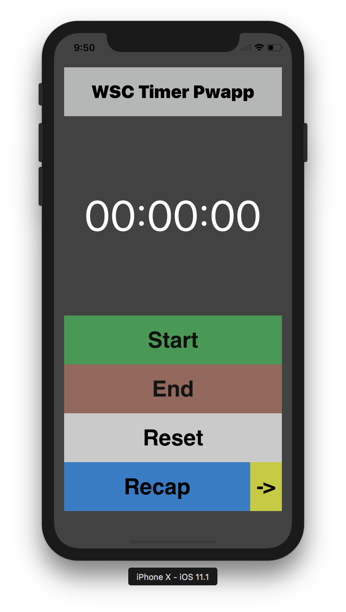
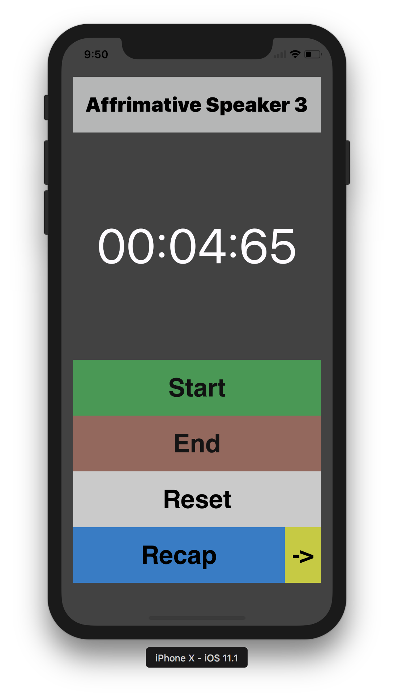
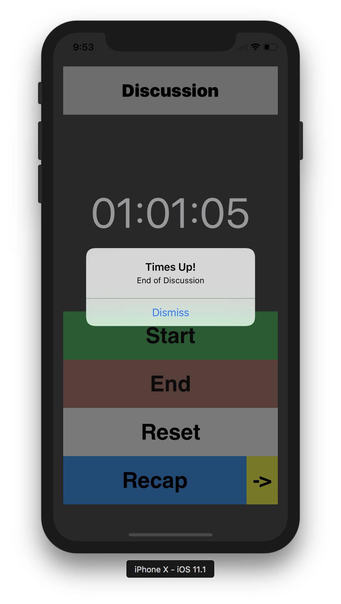
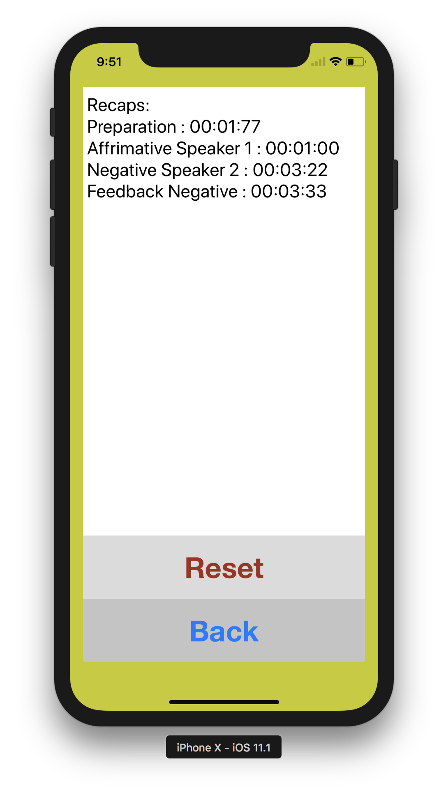

# WSCTimer Pwapp
Debate Timer for World Scholars Cup Adjudicator&amp;Scholars

## Programmed Debate Times!

## Time Up Alarm!

## Recap Function for Adjudicator!

## License
This project is licensed under the MIT License - see the [LICENSE](LICENSE) file for details
